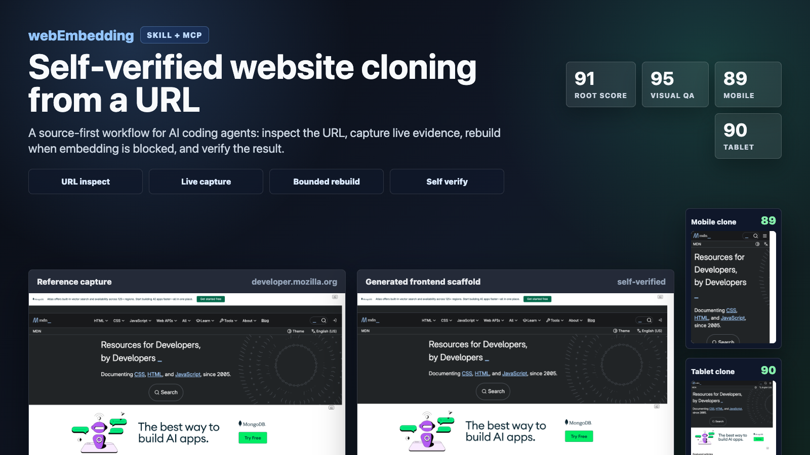

# webEmbedding

`webEmbedding` is a source-first website cloning workflow packaged as a Skill + MCP server for AI coding agents.

It does more than ask an AI to "clone this site." It inspects the URL, chooses the safest reuse or rebuild path, captures the live page, extracts structured page evidence, generates reusable frontend reconstruction artifacts when direct reuse is blocked, and then self-verifies the result with visual, DOM, computed-style, interaction, and responsive-breakpoint checks.



## Current Status

The current pipeline is strongest for static and semi-static web pages:

- company, brand, marketing, and documentation pages
- public landing pages
- iframe-blocked pages that need capture-based reconstruction
- responsive page snapshots across desktop, tablet, and mobile

It is not a full backend or app-logic clone engine. Login-only screens, app-first or native-app-required services, captcha-heavy sites, maps, games, canvas/WebGL-heavy pages, real-time feeds, payments, booking flows, and private server behavior still need separate handling.

## Measured Checkpoints

Recent local benchmark runs from this repo:

| URL | Path | Score |
| --- | --- | --- |
| `https://developer.mozilla.org/en-US/` | iframe-blocked bounded rebuild | root `94`, visual `95`, mobile `94`, tablet `94`, breakpoint average `94` |
| `https://www.mozilla.org/` | bounded rebuild | root `94`, visual `100` |
| `https://www.python.org` | harder bounded rebuild sample | root `90`, visual `100` |
| `https://www.example.com` | exact reuse | ready `yes` |

These are generated by the local self-verify pipeline, not manually assigned ratings.
The reproducible commands and score thresholds are tracked in `docs/benchmark-evidence.json`.
Production readiness gates are tracked in `docs/production-pipeline-gates.json`.

## Core Features

- Source-first routing:
  - direct iframe or embed reuse when it is safe and frameable
  - original preview, export, remix, or source routes when available
  - bounded rebuild only when exact reuse is unavailable
- Live browser capture:
  - DOM snapshot
  - runtime HTML
  - full-page screenshot
  - computed style summaries
  - CSS analysis
  - asset inventory
  - HAR-like network metadata
  - interaction states and replay traces
  - storage state export for session-aware flows
- Blocked-site rebuild:
  - handles `X-Frame-Options` and CSP-blocked pages by rebuilding from captured evidence
  - generates reusable frontend reconstruction artifacts from captured page structure
  - preserves custom tags, shadow-root host structure, and semantic document structure where captured
- Evidence limitation reporting:
  - separates directly captured artifacts from inferred or missing evidence in reproduction results and prompts
  - marks app-gated, auth-gated, and native-app-led surfaces as bounded evidence, with recommendations for user screenshots or authenticated session capture
- Operational failure classification:
  - reports typed pipeline action codes such as `network-replay-limited`, `auth-session-missing`, `public-app-gate`, and `canvas-visual-fallback`
  - exposes HAR/network `replay_readiness` before treating captured network evidence as replay-grade
- Self-verification:
  - screenshot similarity
  - DOM snapshot similarity
  - computed-style similarity
  - hover/focus/click interaction state parity
  - interaction trace parity
  - desktop/mobile/tablet breakpoint reports
- Responsive benchmark support:
  - primary desktop viewport: `1440x1200`
  - tablet profile: `768x1024`
  - mobile profile: `390x844`
- Repair loop:
  - bounded self-repair can run when the first scaffold misses the readiness threshold

## Install

### Requirements

- Node.js 18 or newer
- Python 3.9 or newer
- Chrome or Chromium available locally for Playwright runtime capture

The package uses `playwright-core`; it does not download a browser by itself.

Installing this project adds the `source-first-clone` plugin bundle, the `exact-clone-intake` skill, and the MCP server that exposes the URL inspection, capture, rebuild, and verification tools.

### Install From npm

```bash
npm install -g web-embedding
web-embedding install
web-embedding doctor
```

If you already have an older local plugin installed, overwrite it with:

```bash
web-embedding install --force
web-embedding doctor
```

You can also run the installer without a global install:

```bash
npx web-embedding install
```

### Install From Release

```bash
curl -fsSL https://github.com/jongko54/webEmbedding/releases/latest/download/install.sh | bash
```

### Install From This Checkout

```bash
git clone https://github.com/jongko54/webEmbedding.git
cd webEmbedding
npm install
node ./bin/web-embedding.mjs install
node ./bin/web-embedding.mjs doctor
```

### Install Into A Temporary Home

Useful for testing without touching your real agent home:

```bash
python3 python/web_embedding/installer.py install --target-home ./.tmp/home
python3 python/web_embedding/installer.py doctor --target-home ./.tmp/home
python3 python/web_embedding/installer.py uninstall --target-home ./.tmp/home
```

## Opt-in Telemetry

Telemetry is disabled by default. On an interactive first install, `web-embedding install` asks once and defaults to `No`. Non-interactive installs such as CI and `curl | bash` do not prompt. If you opt in, `web-embedding` sends a small anonymous command-completion event to a JSON POST endpoint you control. It does not send target URLs, local paths, captured HTML, screenshots, storage state, environment variables, API keys, or command output.

Enable it during install:

```bash
web-embedding install --telemetry --telemetry-endpoint https://your-collector.example/events
```

Or manage it later:

```bash
web-embedding telemetry enable --endpoint https://your-collector.example/events
web-embedding telemetry status
web-embedding telemetry disable
web-embedding telemetry reset-id
```

Each event contains an anonymous install id, package version, command name, success/failure status, OS/runtime basics, and coarse option flags such as `breakpoint_count` or `install_source`.

Environment controls:

```bash
WEB_EMBEDDING_TELEMETRY=1
WEB_EMBEDDING_NO_TELEMETRY=1
WEB_EMBEDDING_TELEMETRY_PROMPT=0
WEB_EMBEDDING_TELEMETRY_ENDPOINT=https://your-collector.example/events
WEB_EMBEDDING_TELEMETRY_LOG=./telemetry.jsonl
```

## Quick Start

Inspect a URL and get route hints:

```bash
node ./bin/web-embedding.mjs inspect \
  --url https://developer.mozilla.org/en-US/
```

Run the full clone workflow:

```bash
node ./bin/web-embedding.mjs clone \
  --url https://developer.mozilla.org/en-US/ \
  --output-dir ./.tmp/mdn-clone \
  --wait-seconds 2 \
  --timeout-seconds 35 \
  --breakpoints mobile tablet
```

Run a lightweight quality benchmark:

```bash
python3 scripts/check_clone_quality_bench.py \
  https://developer.mozilla.org/en-US/ \
  --output-root ./.tmp/clone-quality-bench \
  --wait-seconds 1 \
  --timeout-seconds 35 \
  --breakpoints mobile tablet
```

The benchmark prints compact rows for root, visual, and breakpoint scores. The full artifacts are written under the output directory.

## CLI Commands

```bash
node ./bin/web-embedding.mjs capabilities
node ./bin/web-embedding.mjs install
node ./bin/web-embedding.mjs doctor
node ./bin/web-embedding.mjs uninstall
node ./bin/web-embedding.mjs paths
node ./bin/web-embedding.mjs telemetry status
```

```bash
node ./bin/web-embedding.mjs inspect --url https://www.mozilla.org/
```

```bash
node ./bin/web-embedding.mjs capture \
  --url https://www.mozilla.org/ \
  --output-dir ./.tmp/capture-mozilla \
  --breakpoints mobile tablet
```

```bash
node ./bin/web-embedding.mjs reproduce \
  --url https://www.mozilla.org/ \
  --output-dir ./.tmp/reproduce-mozilla \
  --breakpoints mobile tablet
```

```bash
node ./bin/web-embedding.mjs clone \
  --url https://www.mozilla.org/ \
  --output-dir ./.tmp/clone-mozilla \
  --breakpoints mobile tablet
```

```bash
node ./bin/web-embedding.mjs verify \
  --reference-bundle ./.tmp/reference/capture.json \
  --candidate-bundle ./.tmp/candidate/capture.json
```

## Output Artifacts

A clone run can produce:

- `capture.json`
- `pipeline-run-manifest.json`
- `dom/snapshot.json`
- `dom/runtime.html`
- `styles/computed-summary.json`
- `styles/css-analysis.json`
- `network/manifest.json`
- `network/har.json`
- `network/har-like.json`
- `assets/inventory.json`
- `interactions/states.json`
- `interactions/trace.json`
- `screenshots/runtime.png`
- `session/storage-state.json`
- `reproduction/plan.json`
- `reproduction/evidence-limitations.json`
- `reproduction/rebuild-prompt.txt`
- `reproduction/rebuild/starter.html`
- `reproduction/rebuild/starter.css`
- `reproduction/rebuild/starter.tsx`
- `reproduction/rebuild/next-app/`
- `reproduction/self-verify/summary.json`
- `reproduction/self-verify/renderers/*/verification.json`
- `reproduction/self-verify/renderers/*/visual-qa.json`
- `reproduction/self-verify/renderers/*/breakpoints/*-verification.json`

## Quality Benchmark

Run the default small benchmark:

```bash
npm run check:clone-bench:local
```

Run the universal route regression corpus and expectations gate:

```bash
npm run check:benchmark-routes:local
```

Run a lightweight clone score gate:

```bash
npm run check:clone-score-gate:local
```

Validate the committed benchmark evidence manifest:

```bash
npm run check:benchmark-evidence:local
```

Validate production pipeline gates:

```bash
npm run check:production-readiness:local
```

Classify failure/action codes from a route report:

```bash
npm run classify:pipeline-failures -- --report ./.tmp/universal-route-benchmark/universal-route-report.json
```

Find low-scoring persisted benchmark artifacts:

```bash
npm run summarize:benchmark-scores -- --root ./.tmp --min-score 60 --max-score 70
```

Run specific URLs:

```bash
python3 scripts/check_clone_quality_bench.py \
  https://www.example.com \
  https://www.mozilla.org/ \
  --no-breakpoints
```

Run a responsive benchmark:

```bash
python3 scripts/check_clone_quality_bench.py \
  https://developer.mozilla.org/en-US/ \
  --breakpoints mobile tablet
```

## Development Checks

```bash
python3 -m py_compile \
  bundle/source-first-clone/mcp/source_first_clone/*.py \
  scripts/check_integration_smoke.py \
  scripts/check_clone_quality_bench.py
```

```bash
npm run check:integration:local
```

```bash
git diff --check
```

## Repo Layout

- `bundle/source-first-clone`
  Installed plugin bundle, MCP server, and exact-clone intake skill.
- `bundle/source-first-clone/mcp/source_first_clone`
  Capture, planning, rebuild, repair, and verification engine.
- `bin/web-embedding.mjs`
  Node CLI wrapper.
- `python/web_embedding/installer.py`
  Shared installer and command dispatcher.
- `scripts/check_clone_quality_bench.py`
  URL clone quality benchmark helper.
- `scripts/benchmark_routes.py`
  Universal route/capture-depth regression benchmark helper.
- `scripts/check_benchmark_report.py`
  Benchmark expectation validator for exact, minimum, and contains-style checks.
- `scripts/check_benchmark_evidence.py`
  Benchmark evidence manifest validator.
- `scripts/summarize_benchmark_scores.py`
  Utility for finding low or high scoring persisted benchmark artifacts under an output root.
- `scripts/classify_pipeline_failures.py`
  Operational failure/action taxonomy summarizer for reports and capture artifacts.
- `scripts/check_production_readiness.py`
  Production readiness gate validator for corpus, failure taxonomy, CI wiring, and policy docs.
- `scripts/check_integration_smoke.py`
  Release, install, and URL-only clone smoke test.
- `scripts/release_bundle.py`
  Release artifact builder.
- `docs/`
  Architecture notes and universal benchmark documentation.

## Positioning

The strongest claim for this project is:

> A benchmark-first Skill + MCP workflow for URL-based website cloning that handles iframe-blocked pages and reports reproducible visual, DOM, style, interaction, and responsive breakpoint scores.

Avoid treating the output as a legal or ownership bypass. The engine can reconstruct public page structure, but permission, licensing, and acceptable use still matter.

## License

MIT
